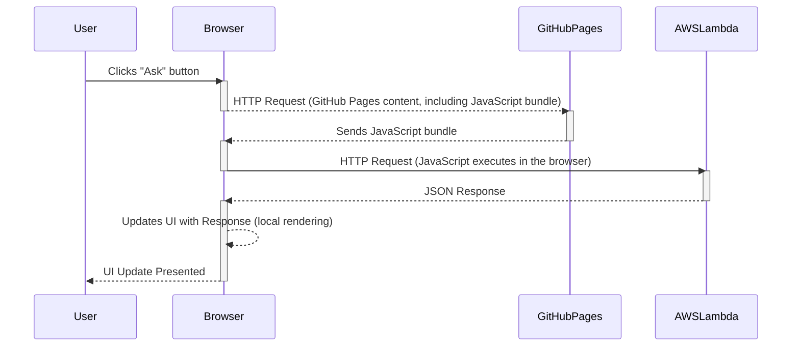

# Hello React App with AskButton.js

This repository contains a simple React application with an `AskButton.js` component. When the user clicks the "Ask" button, the app makes an HTTP request to an AWS Lambda URL, processes the response, and updates the UI with the received data.

### How It Works

The user interacts with the GitHub Pages-hosted React app and clicks the "Ask" button.



### Testing the App

1) Test the backend with curl CLI

```bash
curl -s https://vyvvqaw46b643cmqiohh4abq3q0sglbb.lambda-url.us-west-2.on.aws
```
and expect to see JSON output as follows:

>{
  "answer": "42 is the Answer to the Ultimate Question of Life, the Universe, and Everything"
}


2) Test the App in the action

Open [https://considerable.github.io/hello-react-gh-pages/](https://considerable.github.io/hello-react-gh-pages/) in a JavaScript-compatible browser. Make sure your browser supports JavaScript, and if you encounter any issues, check the browser console for error messages.

3) Inspect the source code of [AskButton.js](https://github.com/considerable/hello-react-gh-pages/blob/main/src/AskButton.js)

Feel free to explore the app and provide feedback based on your testing experience.
