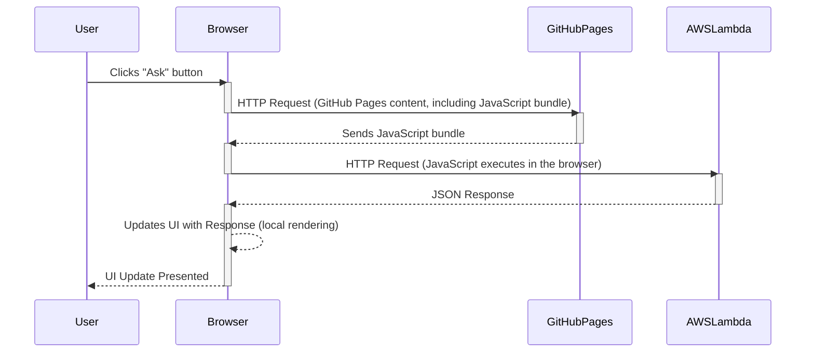

# Hello React App with GitHub Pages and AWS Lambda

This repository demonstrates a working proof-of-concept (POC) for static web hosting using GitHub Pages, integrated with a serverless backend powered by Amazon AWS Lambda.

### Features

- **Static Web Hosting**: The React application is hosted on GitHub Pages, providing a seamless and cost-effective way to serve static content.
- **Serverless Backend**: Utilizes AWS Lambda to handle backend logic, ensuring scalability and reducing server management overhead.
- **Interactive UI**: The `AskButton.js` component allows users to interact with the app, triggering backend processes and updating the UI in real-time.

### Overview

This project showcases a simple React application that includes an `AskButton.js` component. When users click the "Ask" button, the application sends an HTTP request to an AWS Lambda function, processes the response, and dynamically updates the user interface with the received data.

### How It Works

The user interacts with the GitHub Pages-hosted React app and clicks the "Ask" button.



### Testing the App

1) Test the backend with curl CLI

```bash
curl -s https://dmqqfwxqwjya6jkwx3u5j2yw240wxuzo.lambda-url.us-west-2.on.aws
```
and expect to see JSON output as follows:

>{"message": "42 is the Answer to the Ultimate Question of Life, the Universe, and Everything"}


2) Test the App in the action

Open [https://considerable.github.io/hello-react-gh-pages/](https://considerable.github.io/hello-react-gh-pages/) in a JavaScript-compatible browser. Make sure your browser supports JavaScript, and if you encounter any issues, check the browser console for error messages.

3) Inspect the source code of [AskButton.js](https://github.com/considerable/hello-react-gh-pages/blob/main/src/AskButton.js)

4) Inspect the source code of [lambda_function.py](https://github.com/considerable/hello-react-gh-pages/blob/main/aws/lambda_function.py)

### AWS Lambda Integration

The AWS Lambda function is set up to handle HTTP requests from the React application. Ensure you have the correct endpoint URL configured in your application to interact with the Lambda function.

### Contributing

Feel free to explore the app and provide feedback based on your testing experience.

### License

This project is licensed under the MIT License. 
